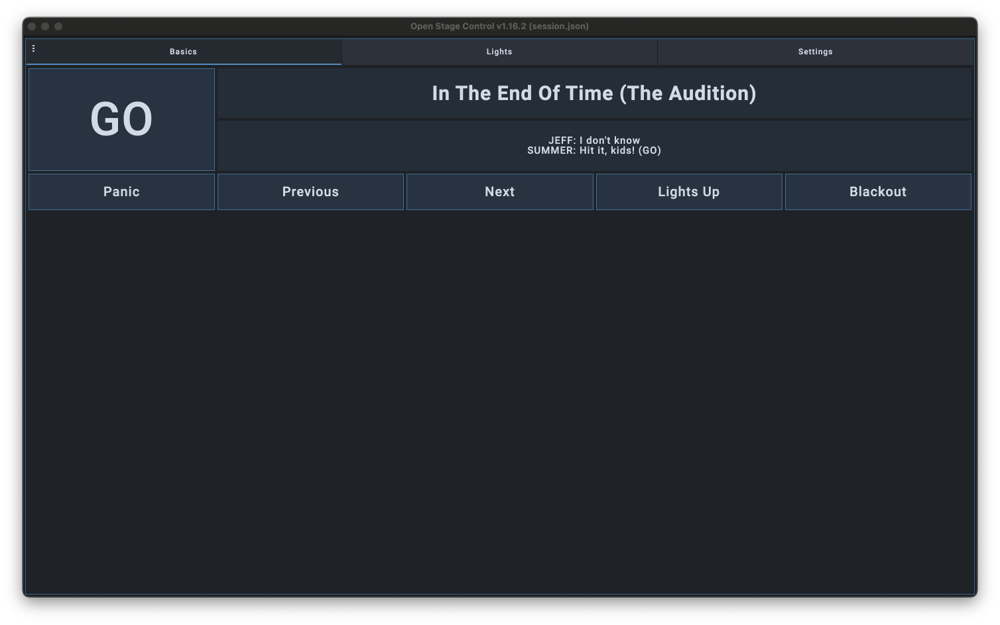
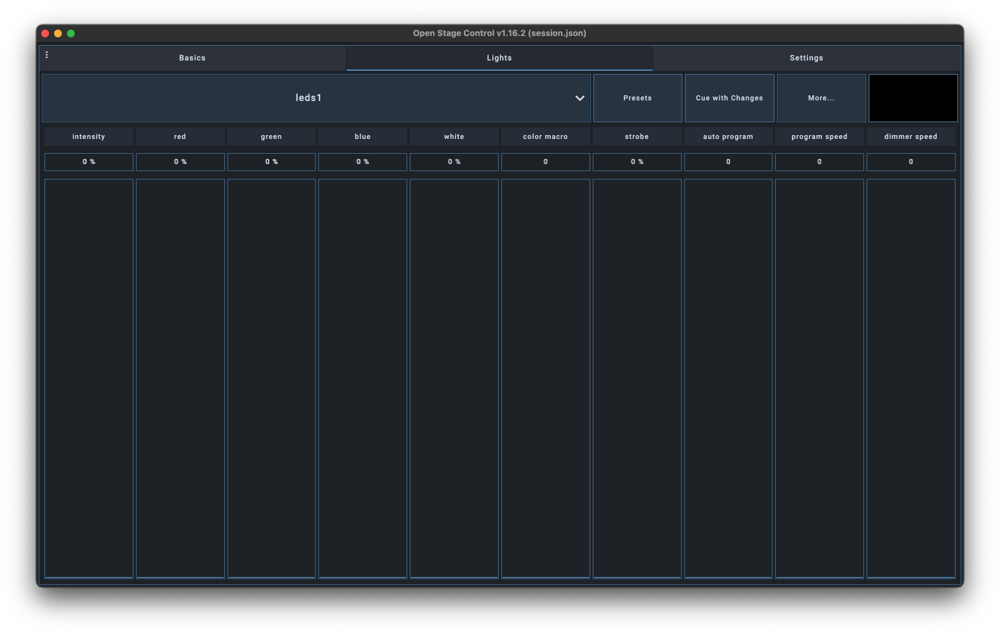

# Open Stage Control QLab

An [Open Stage Control](https://github.com/jean-emmanuel/open-stage-control) session that's designed to control Figure 53's [QLab](https://qlab.app/). It is currently set up predominantly for lighting programming through QLab but can also be used as a remote "GO" and "PANIC". 

## Features

- Remote GO, PANIC, Previous, Next, Lights Up, and Blackout buttons
- Current cue display
- Live lighting control through faders
- Lighting presets

## Installation

Simply clone this repository, download and install the latest version of [Open Stage Control](https://github.com/jean-emmanuel/open-stage-control/releases/latest), then open the server.config file.

## Screenshots

